<p align="center">
  
</p>

<h1 align="center">SoloBoard</h1>

<p align="center">
  <strong>Autonomous development orchestrator for Claude Code</strong><br>
  From invisible kanban to autonomous dev team. 94 tools.
</p>

<p align="center">
  
  
  
  
</p>

---

## What is this?

SoloBoard is a Claude Code plugin that **silently** tracks your tasks as you work. No setup commands, no context switching, no overhead. Just code — the board manages itself.

```
you > fix the login bug on mobile
                                    ← task silently created in DOING

claude > Found the issue in auth.ts:47...
                                    ← files auto-tracked to task

you > commit this
                                    ← commit SHA auto-linked to task

you > /soloboard-board

  TODO (1)       DOING (1)              DONE (3)
                 → Fix login bug        ✓ Setup auth
                   on mobile            ✓ Add dark mode
                   abc1234              ✓ Refactor API
```

<p align="center">
  
</p>

## Install

### Option A: npm global (recommended)
```bash
npm install -g soloboard
soloboard install            # in your project directory
```

### Option B: Clone & build
```bash
git clone https://github.com/egorfedorov/Soloboard.git
cd Soloboard && npm install && npm run build
bash install.sh /path/to/your/project
```

Then just `cd your-project && claude` — the board manages itself.

## Getting Started

See the [Getting Started Guide](docs/getting-started.md) for a complete walkthrough — installation, first use, common workflows, and troubleshooting.

## How it works

| You do | SoloBoard does (silently) |
|--------|--------------------------|
| `"fix the login bug"` | Creates task → DOING |
| `"how does auth work?"` | Nothing — it's a question |
| `"add dark mode"` | Moves previous task → TODO, creates new → DOING |
| Edit files | Auto-tracks changed files to active task |
| `git commit` | Auto-links commit SHA to active task |
| `/soloboard-board` | Shows the kanban board |
| `/soloboard-task done` | Moves active task → DONE |

## Commands

| Command | What it does |
|---------|-------------|
| `/soloboard-board` | View your kanban board |
| `/soloboard-task` | Show active task / `done` / `create <title>` / `delete <name>` |
| `/soloboard-project` | Show project / `create <name>` / `list` / `switch <name>` |

## Features

- **Zero friction** — no setup commands, board auto-initializes on first prompt
- **Silent tracking** — tasks created from actionable prompts, questions ignored
- **Smart task creation** — analyzes project to find related files, auto-tags, and sets priority
- **Task context** — saves what you examined, decisions made, remaining work per task
- **Task agents** — auto-generates `.claude/agents/` files for complex tasks
- **Auto-review** — pre-close analysis checks for TODOs, tests, type errors before marking done
- **Task splitting** — break complex tasks into subtasks with progress tracking
- **Dependencies** — blocked-by relationships with circular dependency detection
- **Critical path** — find the bottleneck chain that determines project duration
- **Sprints** — time-boxed task grouping with burndown tracking
- **Daily standup** — automated standup summary: done, in-progress, blocked
- **Pomodoro timer** — focus sessions tied to tasks
- **Auto-manager** — project health score, stall detection, smart suggestions
- **Gantt chart** — text-based timeline view with dependency visualization
- **Auto-reprioritize** — smart priority adjustment based on blockers and progress
- **Git integration** — commits, branches, and PRs auto-linked to tasks
- **Fuzzy search** — say "move login bug to done" and it finds the right task
- **File-per-task storage** — each task is a JSON file in `.kanban/tasks/`, git-friendly
- **Safe** — only touches `.kanban/` in your project, no network, no dangerous ops
- **3 statuses** — TODO, DOING, DONE. That's it.
- **Time tracking** — automatic: tracks time in DOING, shows per-task and total
- **Priority sorting** — high tasks float to top of each column automatically
- **Markdown export** — export the board as markdown for reports or sharing
- **Multi-project dashboard** — see all projects at a glance with `dashboard`
- **Global CLI** — `npm install -g soloboard && soloboard install`
- **Multi-agent orchestration** — register agents, claim tasks, lock files, handoff context
- **NL planning** — describe what you want to build, get a structured task plan
- **Predictive estimates** — learns from history, predicts task durations
- **Risk assessment** — git hotspots, dependency depth, complexity scoring
- **GitHub/Linear/Jira sync** — push/pull issues, bidirectional status sync
- **PR auto-flow** — branch → commit → push → PR → link to task
- **Autonomous code review** — finds TODOs, type errors, security issues
- **QA automation** — run tests, parse results, create bug tasks for failures
- **DevOps pipeline** — deploy check, run, status with approval gates
- **Tech lead mode** — distribute tasks to agents by skills and complexity
- **Team management** — add members with roles, track workload, suggest assignments
- **Approval workflow** — human-in-the-loop for autonomous decisions
- **VSCode extension** — visual board in sidebar with live file watching

## Architecture

```
soloboard/
├── src/mcp-server/
│   ├── index.ts              # Entry point (stdio transport)
│   ├── server.ts             # MCP server + 94 tools
│   ├── tools/
│   │   ├── task-tools.ts     # create/update/get/list/move/delete
│   │   ├── board-tools.ts    # view/project-create/list/switch
│   │   ├── session-tools.ts  # log/summary
│   │   ├── git-tools.ts      # link/status
│   │   ├── init-tools.ts     # auto_init/board_summary
│   │   ├── export-tools.ts   # export/dashboard/prioritize/time
│   │   ├── smart-tools.ts    # smart_create/analyze (project analysis)
│   │   ├── context-tools.ts  # context_save/load (task continuity)
│   │   ├── agent-tools.ts    # agent_create/delete (.claude/agents/)
│   │   ├── review-tools.ts   # pre-close review & checklist
│   │   ├── dependency-tools.ts # depend/blockers/critical_path
│   │   ├── subtask-tools.ts  # split/subtasks
│   │   ├── sprint-tools.ts   # create/add/close/view
│   │   ├── standup-tools.ts  # standup/pomodoro
│   │   ├── manager-tools.ts  # report/stall/suggest/reprioritize/gantt
│   │   ├── orchestration-tools.ts  # v1.5: agent register/claim/handoff/lock
│   │   ├── planning-tools.ts       # v2.0: plan from prompt/apply/templates
│   │   ├── prediction-tools.ts     # v2.0: predict/velocity/burndown
│   │   ├── risk-tools.ts           # v2.0: risk assess/report/classify
│   │   ├── sync-tools.ts           # v2.0: GitHub/Linear/Jira sync
│   │   ├── pr-tools.ts             # v2.0: PR create/status/auto-flow
│   │   ├── approval-tools.ts       # v3.0: request/list/resolve
│   │   ├── code-review-tools.ts    # v3.0: review run/findings/respond
│   │   ├── qa-tools.ts             # v3.0: qa run/report/rerun/coverage
│   │   ├── devops-tools.ts         # v3.0: deploy check/run/status
│   │   ├── tech-lead-tools.ts      # v3.0: distribute/status/reassign/pipeline
│   │   └── team-tools.ts           # v3.0: add/list/assign/workload/suggest
│   ├── storage/              # Atomic writes, file-per-task
│   ├── models/               # Task, Board, Session, Sprint, Config + 8 new models
│   └── utils/                # nanoid, git, project analyzer, file-lock, external-sync
├── vscode-extension/         # VSCode sidebar board view
├── scripts/                  # Hook scripts (session, files, commits)
├── commands/                 # Slash command definitions
├── skills/                   # Smart auto-tracking skill
└── install.sh                # One-command installer
```

**Data stored in your project:**

```
.kanban/
├── config.json               # Active project + session
├── boards/{id}.json          # Board columns (task IDs)
├── tasks/{id}.json           # One file per task (with context)
├── sprints/{id}.json         # Sprint definitions
├── archive/{id}.json         # Completed old tasks
├── sessions/{id}.json        # Session logs (gitignored)
├── agents/{id}.json          # v1.5: Agent registrations
├── handoffs/{id}.json        # v1.5: Handoff contexts
├── locks/{hash}.lock.json    # v1.5: File locks
├── history/{id}.json         # v2.0: Completion records
├── velocity/{id}.json        # v2.0: Velocity snapshots
├── approvals/{id}.json       # v3.0: Approval requests
├── reviews/{id}.json         # v3.0: Code reviews
├── qa/{id}.json              # v3.0: QA results
├── deployments/{id}.json     # v3.0: Deployments
└── team/{id}.json            # v3.0: Team members
```

## MCP Tools (94)

| Tool | Purpose |
|------|---------|
| **Init** | |
| `auto_init` | Initialize board + session (idempotent) |
| `board_summary` | One-line status for context injection |
| **Smart Tasks** | |
| `task_smart_create` | Create task with auto-analysis, tags, priority |
| `task_create` | Create task with title, priority, tags |
| `task_update` | Update task fields |
| `task_get` | Get task by ID or fuzzy name |
| `task_list` | List tasks, filter by status |
| `task_move` | Move between TODO/DOING/DONE |
| `task_delete` | Archive or delete task |
| `task_prioritize` | Change priority + auto-sort column |
| `task_time` | Time tracking report per task or all |
| `task_analyze` | Deep project analysis for a task |
| **Context & Agents** | |
| `task_context_save` | Save context: files, decisions, remaining work |
| `task_context_load` | Load context when resuming a task |
| `task_agent_create` | Generate `.claude/agents/` file for a task |
| `task_agent_delete` | Clean up agent file when done |
| `task_review` | Pre-close: TODOs, tests, changes, type check |
| **Dependencies** | |
| `task_depend` | Add/remove dependency between tasks |
| `task_blockers` | Show dependency graph for task or all |
| `critical_path` | Find the longest dependency chain (bottleneck) |
| **Subtasks** | |
| `task_split` | Break task into subtasks |
| `task_subtasks` | View subtask progress |
| **Sprints** | |
| `sprint_create` | Create a time-boxed sprint |
| `sprint_add` | Add tasks to a sprint |
| `sprint_close` | Close sprint, optionally carry over incomplete |
| `sprint_view` | Sprint progress with burndown |
| **Standup & Focus** | |
| `standup` | Daily standup: done, in-progress, blocked |
| `pomodoro_start` | Start a focus session on a task |
| `pomodoro_status` | Check pomodoro timer |
| **Auto-Manager** | |
| `manager_report` | Health score, velocity, stalls, suggestions |
| `stall_detect` | Find tasks with no recent activity |
| `suggest_next` | AI-powered "what to work on next" |
| `auto_reprioritize` | Smart priority adjustment (dry run or apply) |
| `gantt_view` | Text-based Gantt chart with dependencies |
| **Board & Export** | |
| `board_view` | Full kanban board (sorted by priority) |
| `board_export` | Export board as markdown |
| `dashboard` | Multi-project overview with time totals |
| `project_create` | Create project board |
| `project_list` | List all projects |
| `project_switch` | Switch active project |
| **Session & Git** | |
| `session_log` | Log file/commit to session |
| `session_summary` | Session activity summary |
| `git_link` | Link commit/branch/PR to task |
| `git_status` | Git repo status + recent commits |
| **v1.5: Multi-Agent** | |
| `agent_register` | Register agent session for multi-agent work |
| `agent_heartbeat` | Update heartbeat, clean stale agents |
| `agent_list` | List active agents + tasks + locked files |
| `agent_claim_task` | Assign task to agent (fails if claimed) |
| `conflict_check` | Check if files locked by another agent |
| `file_lock` | Lock files to prevent concurrent edits |
| `file_unlock` | Release file locks |
| `agent_handoff` | Create handoff context + release locks |
| `agent_pickup` | Accept handoff, get full context |
| `parallel_plan` | Suggest parallelizable task batches |
| **v2.0: Planning** | |
| `plan_from_prompt` | NL description → structured task breakdown |
| `plan_apply` | Bulk-create tasks from plan with deps |
| `plan_templates` | Pre-built templates: SaaS, API, CLI, library |
| `predict_duration` | Predict task time from history |
| `velocity_report` | Tasks/day trends, sprint projection |
| `burndown_data` | ASCII burndown chart for sprint |
| `record_velocity` | Snapshot daily velocity |
| `risk_assess` | Git hotspots + deps → risk level |
| `risk_report` | All tasks ranked by risk |
| `complexity_classify` | Auto-classify trivial → epic |
| `sync_setup` | Configure GitHub/Linear/Jira |
| `sync_push` | Push task to external tool |
| `sync_pull` | Import issues from external |
| `sync_update` | Bidirectional status sync |
| `sync_status` | Show sync state for linked tasks |
| `pr_create` | Branch + push + PR + link |
| `pr_status` | Check PR review/CI/merge |
| `pr_auto_flow` | Full branch → commit → PR flow |
| **v3.0: Autonomous** | |
| `approval_request` | Create approval for human review |
| `approval_list` | List pending approvals |
| `approval_resolve` | Approve/reject with reason |
| `review_run` | Code review: TODOs, types, security |
| `review_findings` | View review findings |
| `review_respond` | Respond: fixed/wont_fix/acknowledged |
| `qa_run` | Run tests, create bug tasks |
| `qa_report` | View QA results |
| `qa_rerun` | Re-run, compare with previous |
| `qa_coverage` | Test coverage for changed files |
| `deploy_check` | Readiness check before deploy |
| `deploy_run` | Execute deployment |
| `deploy_status` | Deployment history |
| `lead_distribute` | Distribute tasks to agents |
| `lead_status` | Dashboard: agents, tasks, pipeline |
| `lead_reassign` | Reassign with handoff context |
| `lead_pipeline` | Coding → review → QA → deploy |
| `team_add` | Add team member with skills |
| `team_list` | List members with stats |
| `team_assign` | Assign task to member |
| `team_workload` | Workload distribution |
| `team_suggest_assignment` | Auto-suggest by skills/availability |

## What install.sh does

1. Adds SoloBoard MCP server to `.mcp.json`
2. Creates hooks in `.claude/settings.json` (file tracking, commit linking)
3. Injects agent instructions into `CLAUDE.md`
4. Initializes `.kanban/` directory
5. Adds `.kanban/sessions/` to `.gitignore`

All reversible. Delete these files to uninstall.

## Dependencies

Only 3 runtime dependencies:

- `@modelcontextprotocol/sdk` — MCP protocol
- `zod` — schema validation
- `nanoid` — ID generation

## License

MIT
